### Welcome to my GitHub profile

Hello, I'm Mauricio. I'm based in Salvador, Brazil.

More about my work and writing: **[mauriciovieira.net](https://mauriciovieira.net)**

I began programming in the 90's, years before starting my studies in Computer Science at Federal University of Bahia (1999-2005). My first internship began in 2000, and my career in software development spans more than 15 years.

I have been working for clients around the globe, and developing business at https://omnicode.solutions, my sole proprietorship consulting company based in Brazil.

You can reach me through:

- [LinkedIn](https://www.linkedin.com/in/mauriciovieira/)
- [Personal website](https://mauriciovieira.net)

